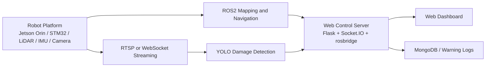

# HappyCircuit

SLAM, LiDAR, YOLO, 웹 관제를 결합해 협소한 구내통신 덕트 내부를 탐색하고 케이블 손상 여부를 확인하는 캡스톤 디자인 프로젝트입니다.

이 저장소는 당시 프로젝트를 그대로 재현하기 위한 배포본이 아니라, 남아 있는 핵심 코드와 산출물을 정리한 포트폴리오용 아카이브입니다.

## 프로젝트 개요

구내통신 선로가 지나가는 EPS실과 천장 덕트는 협소하고 위험해 사람이 직접 점검하기 어렵습니다. 이 프로젝트는 해당 작업을 완전 무인화에 가깝게 대체하는 것을 목표로, 다음 기능을 한 시스템에 묶어 구현했습니다.

- LiDAR 기반 2D SLAM 매핑
- Frontier 기반 자율 탐색
- YOLO 기반 케이블 손상 감지
- 웹 대시보드 기반 원격 관제 및 모니터링

## 핵심 메시지

이 프로젝트에서 가장 크게 배운 점은 "모델 수치"보다 "현장 신뢰성"이 더 중요하다는 사실이었습니다.

케이블 손상 감지 모델은 1,591장의 데이터로 학습했고, 학습 지표는 precision 0.94, recall 0.92 수준으로 좋았습니다. 하지만 실제 라즈베리파이 촬영 환경에서는 빛 반사와 그림자 때문에 탐지가 흔들렸습니다. 직접 촬영한 100장과 학습용 100장을 비교해 원인을 분석했고, 반사와 노출 조건을 반영한 데이터 증강을 다시 적용했습니다. 그 결과 실제 환경 정확도도 90% 이상으로 회복되며, 실환경 기준의 신뢰성을 확보할 수 있었습니다.

## 내가 맡은 역할

- ROS2 환경에서 LiDAR와 IMU를 활용한 2D 지도 생성 기능 구현
- 캐터필러형 궤도 구조 적용과 기구 설계 개선
- LiDAR 간섭 문제를 줄이기 위한 스프로킷 외경 재설계 및 3D 프린팅 반영
- YOLO 기반 케이블 손상 감지 모델 학습 및 실환경 성능 개선

팀 시스템 전체로는 자율 탐색, 원격 제어 웹 UI, 영상 스트리밍, 데이터 저장까지 포함한 통합 로봇 시스템을 구현했습니다.

## 시스템 구성



상세 버전:

- `docs/architecture.md`
- `docs/raw/architecture_ws_socketio_en.svg`
- `docs/raw/architecture_rtsp_http_en.svg`
- `docs/raw/problem_definition_duct_video_ko.svg`

## 시연 영상

1. 한이음 드림업 측 편집 영상
   - https://www.youtube.com/watch?v=vXDEkrnYE9w
2. 직접 제작한 최종 결과 영상
   - https://www.youtube.com/watch?v=gV9h0e6K7kQ
3. 최종 결과 영상 작업본
   - https://www.youtube.com/watch?v=45l5bawErTk

영상 링크 메모는 `docs/media/demo_video_links.md`에도 정리해 두었습니다.

## 성과

### 수상

- 한이음 드림업 장려상
- 한국정보처리학회 KIPS 우수논문상 동상
- 졸업작품 캡스톤 디자인 최우수상
- Withus 우수동아리상

### 논문 및 결과물

- 학술대회 논문 2편 작성
- 우수논문상 수상
- 최종보고서, 제작설계서, 주간보고서, 포트폴리오 PDF, 판넬 자료 보유

### 프로젝트 지원 및 상금

- 한이음 프로젝트 지원금 130만 원
- Withus 동아리 지원금 100만 원
- 미니 캡스톤디자인 후속 지원금 80만 원
- 한이음 장려상 상금 40만 원
- 졸업작품 최우수상 상금 83만 원
- Withus 우수동아리상 상금 30만 원

## 저장소 구성

```text
src/
  navigation/   ROS2 탐색 및 주행 관련 코드 스냅샷
  vision/       YOLO 추론, 스트리밍 관련 코드
  web/          Flask 기반 웹 관제 UI

data/models/
  학습 결과 모델과 NCNN 변환 결과

notebooks/
  실험 노트북과 최종 학습 노트북

docs/
  상장, 논문, 보고서, 발표자료, 사진, 운영 메모

archive/
  스트리밍 실험 코드와 보조 측정 스크립트
```

문서 자료 안내는 `docs/DOCUMENTS.md`에 정리해 두었습니다.

## 현재 상태와 한계

- 실제 캡스톤 당시 시스템은 ROS2, 하드웨어, 네트워크 인프라를 함께 사용했지만 현재는 전체 워크스페이스가 모두 남아 있지는 않습니다.
- 로봇 하드웨어와 일부 ROS 실행 환경은 유실되어, 이 저장소만으로 당시 시스템을 완전 재현하는 것은 어렵습니다.
- 일부 소스 파일은 레거시 스냅샷 성격이며, 포트폴리오 관점에서는 "무엇을 만들었고 어떤 근거 자료가 남아 있는가"에 초점을 두고 있습니다.

즉, 이 저장소는 완전한 배포본이 아니라 프로젝트 경험과 성과를 설명하기 위한 아카이브입니다.

## 참고 자료

- 문서 인덱스: `docs/DOCUMENTS.md`
- 아키텍처 문서: `docs/architecture.md`
- 운영 메모: `docs/notes/legacy_deployment_notes.md`
- RTSP 서버 코드 스냅샷: `docs/notes/legacy_rtsp_server_app.py.txt`
