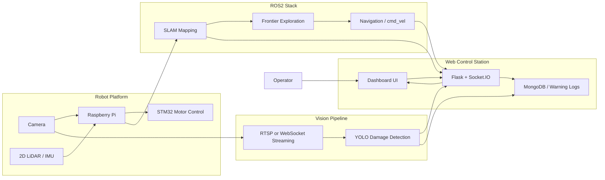
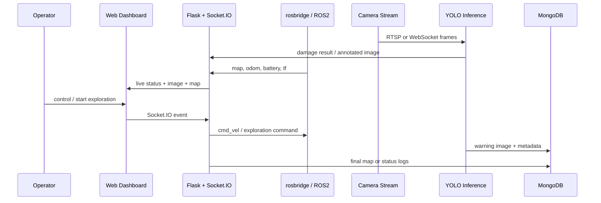

# Architecture

포트폴리오에서 빠르게 이해할 수 있도록 Mermaid 기준으로 다시 정리한 시스템 아키텍처입니다.

## 1. System Overview

## 2. Runtime Flow

## 3. Notes

- 위 다이어그램은 "통합 시스템 구조"를 설명하기 위한 문서입니다.
- 기존 SVG 참고 자산은 `docs/raw/`에 보관했습니다.
